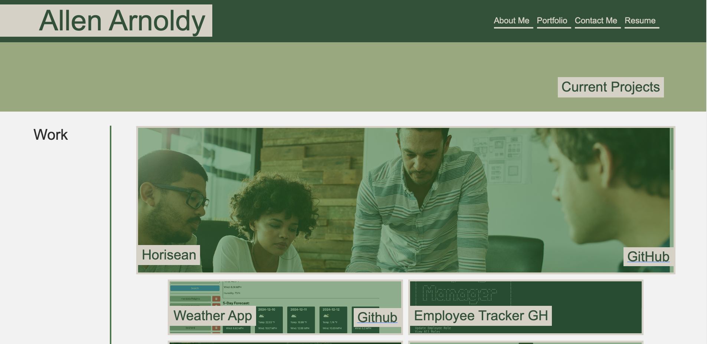

# portfolio

## Description
This is a single-page web developer portfolio that showcases my skills, projects, and contact details. The portfolio includes sections such as About Me, Portfolio, Contact, and Resume, with a user-friendly navigation system that highlights the current section. The page is interactive, responsive, and highlights my experience and proficiency as a developer.

## Table of Contents
- [Description](#description)
- [installation](#installation)
- [usage](#usage)
- [License](#license)
- [Contributing](#contributing)
- [Tests](#test)
- [Questions](#questions)

## Installation

To install and use this application locally, please follow these steps:

1. Clone the repository using the SSH:

    `git@github.com:allenarnoldy/portfolio.git`
2. Navigate to the project directory:

    `cd portfolio`
3. Install the dependencies:

    `npm install` 

## Usage
To use the portfolio locally you will run:

    `npm run dev`

You can also visit the live page:

    TBD

## License

This project is under the MIT License.

## Contributions

contributions are welcome. I did get some help from the TA Austin with converting the temp to Imperial. I also had great help from the tutor Chris.

## Tests

Test the code by selecting the navigation bar and going through all the pages.

## Questions
- GitHub: https://github.com/allenarnoldy
- Email: allenarnoldy@gmail.com